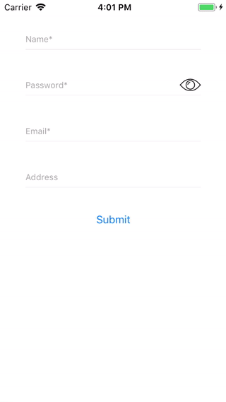

# A2ATextField

[](https://travis-ci.org/Ferrick90/A2ATextField)
[](https://cocoapods.org/pods/A2ATextField)
[](https://cocoapods.org/pods/A2ATextField)
[](https://cocoapods.org/pods/A2ATextField)

A2ATextField class to float the Placeholder and validate the text while editing.

## Features
- [x] Floating effect in placeholder
- [x] Change border style to bottom line
- [x] Change placeholder active and inactive text color
- [x] Mandatory option
- [x] Show and change error text
- [x] Validate the text while editing

## Preview


## Example

To run the example project, clone the repo, and run `pod install` from the Example directory first.

## Requirements

## Installation

A2ATextField is available through [CocoaPods](https://cocoapods.org). To install
it, simply add the following line to your Podfile:

```ruby
pod 'A2ATextField'
```

## How to use
### Objective-C
#### Set placeholder
```
self.textField.placeholder = @"Name*"; // Default is nil
```

#### Change border style to bottom line
```
self.textField.bottomBorderOnly = YES; // Default is NO
```

#### Change the placeholder active color
```
self.textField.placeholderActiveColor = [UIColor colorWithRed:38/255.0 green:108/255.0 blue:194/255.0 alpha:1.0];
```

#### Change the placeholder inactive color
```
self.textField.placeholderInactiveColor = [[UIColor grayColor] colorWithAlphaComponent:0.7];
```

#### Set Style
```
// either A2ATextFieldStyleEmail or A2ATextFieldStyleNone
self.textField.style = A2ATextFieldStyleEmail; // Default value is A2ATextFieldStyleNone
```

#### Set mandatory
```
self.textField.isMandatory = YES; // Default value is NO
```

#### Change mandatory error message
```
self.textField.errorText = @"Please input a valid name"; // Default value is Error
```

#### Show error text
##### 1) show default error text
```
[self.textField error];
```
##### 2) show cutom error text
```
[self.textField error:@"Please input a valid name"];
```

#### Validate the text while editing
```
[self.textField setValidationBlock:^(A2ATextField *textField) {
	if (textField.text.length < 8) {
		[self.textField error];
		return NO; // error
	}

	return YES; // success
}];
```

#### Validation Success
```
BOOL status = YES;

if (!self.textField.validationSuccess) {
	status = NO;
}

if (status == YES) {
	// success (do somethings like call api or etc.)
} else {
	// error
}	
```

### Swift
#### Set placeholder
```
self.textField.placeholder = "Name" // Default is nil
```

#### Change border style to bottom line
```
self.textField.bottomBorderOnly = true // Default is NO
```

#### Change the placeholder active color
```
self.textField.placeholderActiveColor = UIColor(red: 38/255, green: 108/255, blue: 194/255, alpha: 1.0)
```

#### Change the placeholder inactive color
```
self.textField.placeholderInactiveColor = UIColor.gray.withAlphaComponent(0.7)
```

#### Set Style
```
// either A2ATextFieldStyle.email or A2ATextFieldStyle.none
self.textField.style = email // Default value is A2ATextFieldStyle.none
```

#### Set mandatory
```
self.textField.isMandatory = true // Default value is NO
```

#### Change mandatory error message
```
self.textField.errorText = "Please input a valid name" // Default value is Error
```

#### Show error text
##### 1) show default error text
```
self.textField.error()
```
##### 2) show cutom error text
```
self.userTextField.error("Please input a valid name")
```

#### Validate the text while editing
```
self.textField.setValidationBlock { (textField) -> Bool in
	if ((textField?.text?.count)! < 8) {
		self.passTextField.error()
		return false
	}

	return true
}
```

#### Validation Success
```
var status: Bool = true

if (!self.textField.validationSuccess()) {
	status = false
}

if (status == true) {
	// success (do somethings like call api or etc.)
} else {
	// error
}	
```

## Author

Ferrick90, ferrick1990@hotmail.com

## License

A2ATextField is available under the MIT license. See the LICENSE file for more info.
